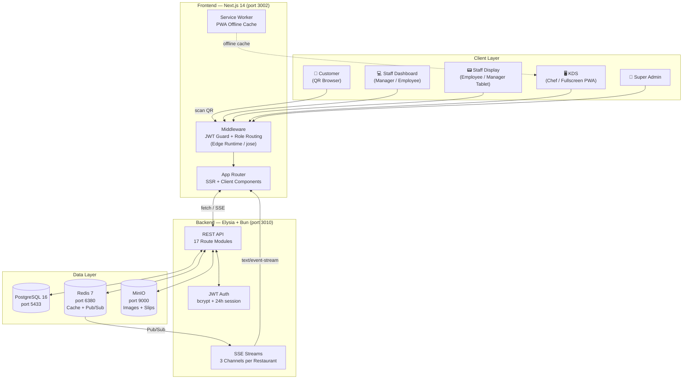
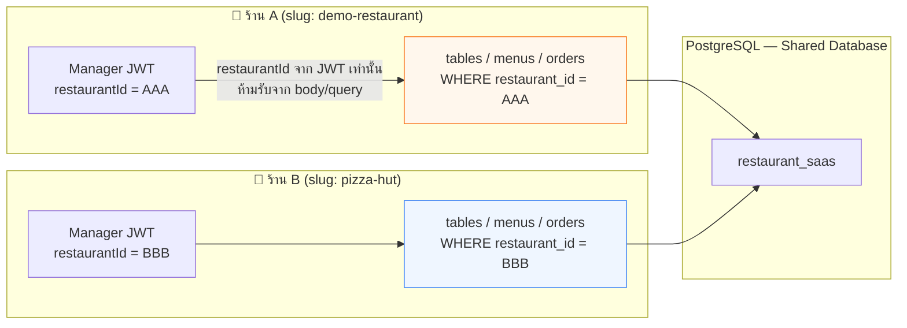
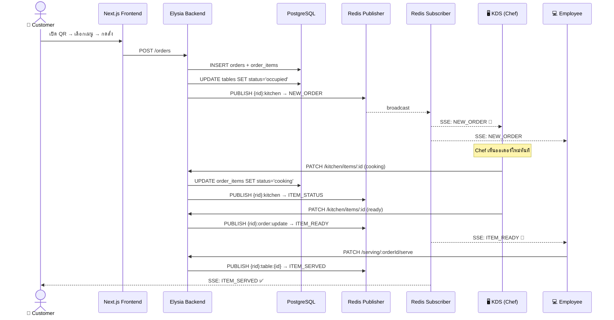
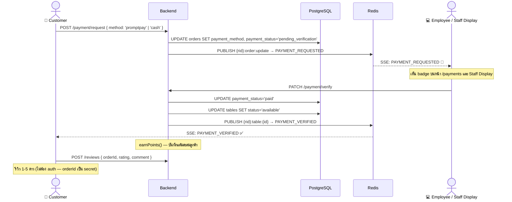
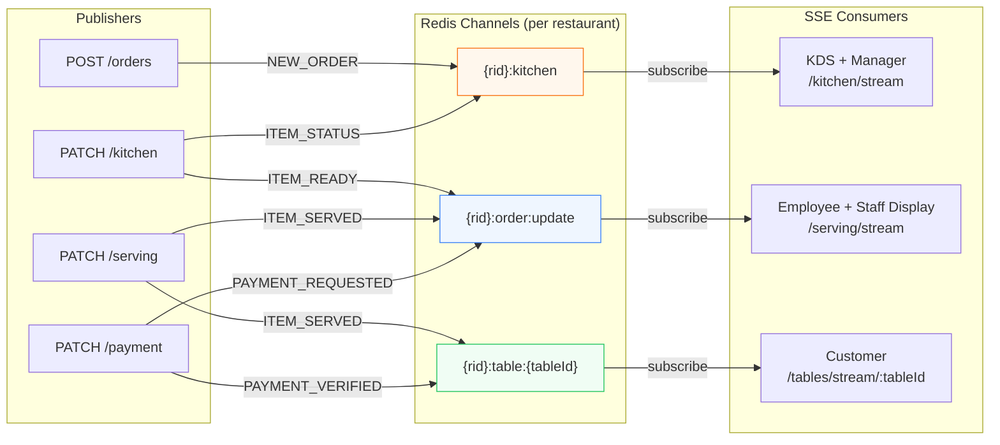
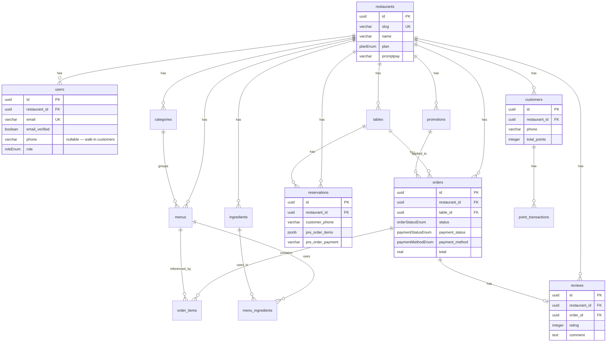
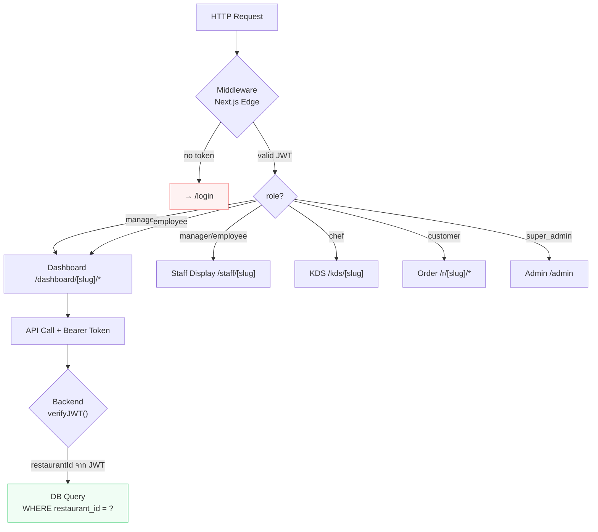
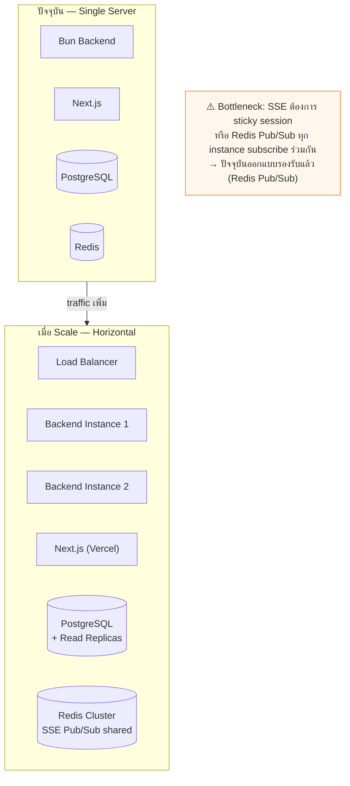

# Architecture — Restaurant SaaS Platform

## 1. System Overview

---

## 2. Multi-Tenant Architecture

> แต่ละร้านใช้ฐานข้อมูลร่วมกัน (Shared Database) แต่ isolate ด้วย `restaurant_id` ทุก query

**เหตุผลที่เลือก Shared DB แทน Schema-per-tenant:**
- ร้านส่วนใหญ่มี traffic ต่ำ — ไม่คุ้มค่า overhead
- Migration ทำครั้งเดียวทุก tenant
- ง่ายต่อการ query cross-tenant ในหน้า Super Admin

---

## 3. Realtime Order Flow

---

## 4. Payment & Review Flow

---

## 5. SSE Architecture

> เลือก SSE แทน WebSocket เพราะ traffic เป็น **server→client เท่านั้น** ไม่จำเป็นต้อง bidirectional

---

## 6. Entity Relationship Diagram

---

## 7. Authentication & Authorization

---

## 8. Trade-offs & Design Decisions

| การตัดสินใจ | ที่เลือก | ทางเลือกอื่น | เหตุผล |
|---|---|---|---|
| Realtime | SSE | WebSocket | Traffic เป็น server→client เท่านั้น, ง่ายกว่า, reconnect built-in |
| Multi-tenant | Shared DB + `restaurant_id` | Schema per tenant | Scale เล็ก overhead ต่ำ migration ง่าย |
| Auth | JWT + Redis session | Session-only / OAuth | Stateless + revoke ได้ทันที (logout ลบ key) |
| Cache | Redis | In-memory / Memcached | ใช้อยู่แล้วสำหรับ Pub/Sub ลด dependency |
| ORM | Drizzle | Prisma / TypeORM | Type-safe, lightweight, SQL-like API เหมาะกับ Bun |
| Storage | MinIO (S3-compatible) | Cloudinary / local disk | Self-hosted, S3 API standard, ย้ายไป AWS S3 ได้ทันที |
| Runtime | Bun | Node.js | Performance สูงกว่า, built-in TypeScript |

---

## 9. Scalability Considerations

